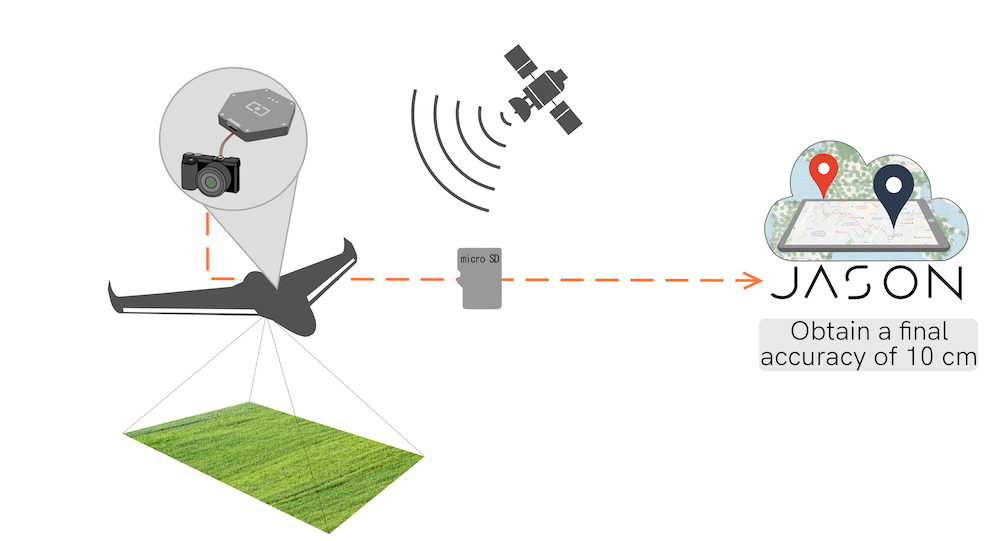
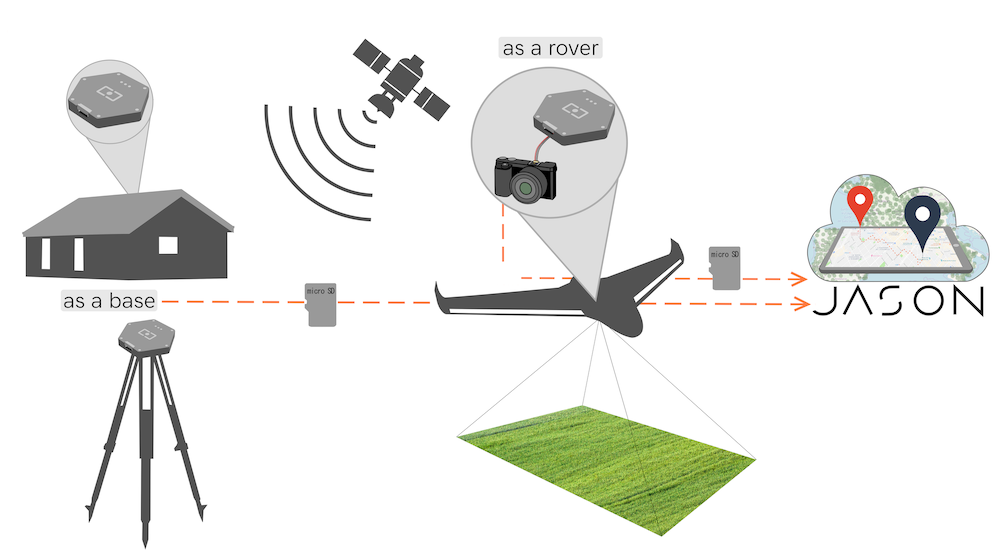
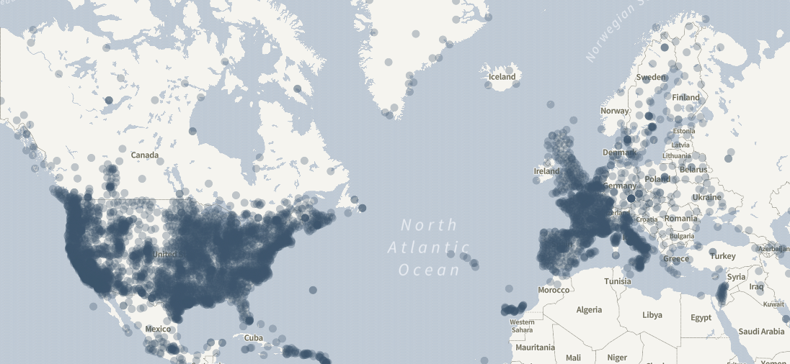

# Welcome to Virtual-lab documentation

Virtual-lab is a cloud service that computes the position of a GNSS rover receiver using raw GNSS measurements.

Virtual-lab works on a best-effort basis: it will attempt to compute the best possible solution using a differential technique known as Post-Processed Kinematic (PPK), which is the post-processing version of the widely known Real Time Kinematics (RTK). These techniques combine GNSS measurements from nearby **reference stations** with those of the rover being positioned to mitigate most of the common errors to the two GNSS receivers (ionosphere, troposphere, ...). By _nearby_ it is usually considered that the GNSS receivers should be positioned less than 50km apart. Depending on the conditions under which the GNSS raw data was collected centimeter level accuracies can be achieved.

If you do not have a reference station Virtual-lab will automatically look for a suitable Continously Operating Reference Station (CORS), among the ones regularly monitored by the service, and use it to try to achieve the best possible accuracy for your data.

## Features

- **Ease of use**, drag and drop GNSS files 
- Process [various input formats](../manual#supported-formats) (RINEX, ublox, Septentrio, Android GNSS Logger, ...)
- Differential positioning for greater accuracy without the need to deploy a base station, Virtual-lab will **automatically search/fetch/use the closest base station** among the database of more than 7000 stations tracked by our servers
- **Data conversion service** generate an industry standard RINEX ASCII file from a binary file logged by the receiver.

## Use cases

Virtual-lab aims at providing a platform for potential services and use cases that share the same common need: accurate navigation.

### Rover only dataset

In this scenario the end user records the GNSS raw data with hes/hir own GNSS receiver while collecting the different points or trajectory of interest without worring about also collecting the GNSS raw data from her/his own reference station because before going to the field the user ensured that Virtual-lab has a nearby reference station to his/her field work (closer than 50Km if multifrequency receiver is in use).
After finsihing the field survey the end user uploads the rover GNSS raw dataset recorded in the field to Virtual-lab and Virtual-lab will automatically fetch all the required CORS files and will perform all the required file operations to post-process the end user GNSS raw data.

### End-to-end PPK

This use case is similar to the previous case (an operator that performs a data campaign where GNSS raw measurements are logged for later processing), but outside the coverage provided by Virtual-lab base stations network data base. In addition to uploading the rover data set the user also uploads her/his own base station that is recording GNSS raw data during the rover dtaa collection campaign.

This data is then uploaded in the service, as describe in this [example](examples#rover-and-base-files).

## Coverage

The data from the reference stations come from a set of world-wide public providers such
as [International GNSS Service](https://www.igs.org) or [EUREF](http://www.epncb.oma.be/) as
well as smaller national and regional networks such as the [Institut Cartogràfic i Geològic de Catalunya](https://www.icgc.cat) and the like.

In total, we continuously monitor the availability of more than 7000 CORS stations
distributed worldwide. Some areas are better covered than others but unfortunately
we cannot provide global coverage.

