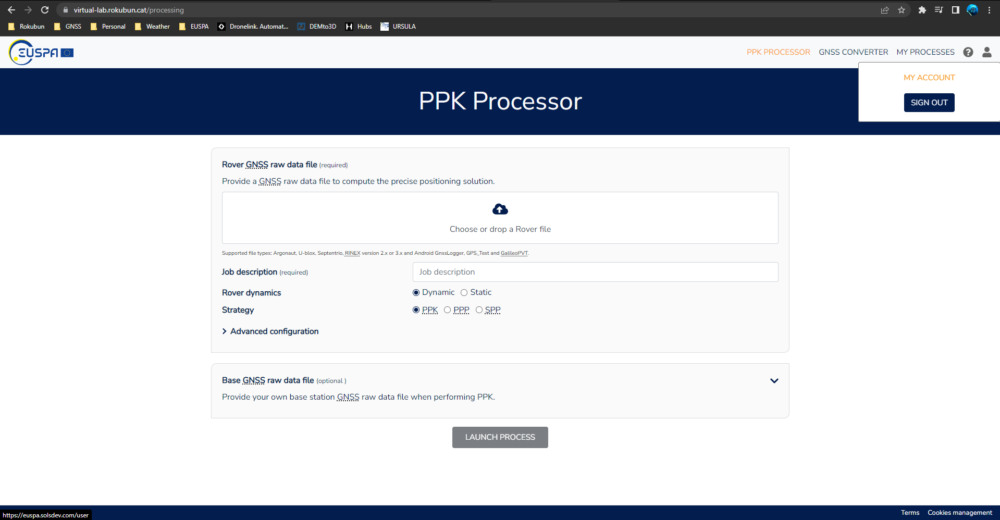
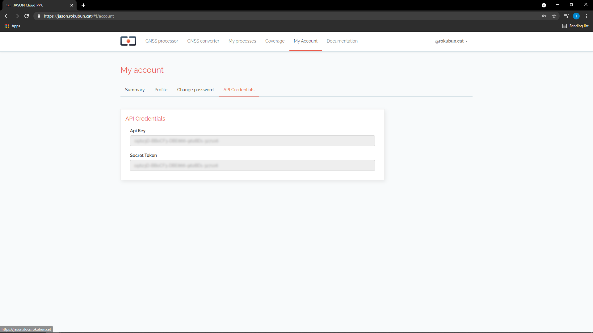

# Manual

## Processing engine

Under the hood, Virtual-lab runs the open-source package
[rtklib](http://www.rtklib.com) as the positioning engine This service works
on a best-effort basis, and attempts to run these
[processing strategies](../strategies) in the following prioritized order:

- _Post Processed Kinematic (PPK)_, Virtual-lab computes a coarse estimate of the rover position using _SPP_ in
  order to have a rough estimate of the receiver position and be able to
  automatically select the closest base station from the set of
  [stations continuously monitored by Virtual-lab](https://Virtual-lab.euspa.europa.eu/#coverage).
  If a nearby station is found (less than a certain baseline),
  then the corresponding RINEX data is downloaded in order to perform differential
  positioning. Alike, if you provide Virtual-lab with a base station measurements file, it will undergo _PPK_ technique processing.
- _Precise Point Positioning (PPP)_, if no nearby base station is found, Virtual-lab will attempt PPP if the precise
  orbits and clocks for the day to be processed are found and the input data
  is multi-frequency.
- _Single Point Positioning (SPP)_, if _PPP_ failed, the data processed using the broadcast orbits and 
  clocks will be delivered.

## Supported formats

Virtual-lab supports the following input formats to input GNSS observables
(pseudorange, carrier-phases, ...):

- Rinex 2/3
- ublox formats (both single and multiple frequency formats). Data from chipsets
  such as NEO-M8T or ZED-F9P are supported. This obviously cover also all GNSS
  receivers that use these chipsets (e.g. Drotek, EMLID receivers, ArduSimple, ...)
- [Google's Android GNSS logger](https://github.com/google/gps-measurement-tools/tree/master/GNSSLogger) (smartphone data)
- [GPS Test app](https://play.google.com/store/apps/details?id=com.android.gpstest) (smartphone data)
- [GalileoPVT app](https://play.google.com/store/apps/details?id=esa.estec.galileo.galileopvt) (smartphone data)
- RTCM 3 data
- Septentrio binary (SBF) files

## Result files

This section include the information of the various file formats delivered by
Virtual-lab.

### GNSS processor files

When a process has been successful, a compressed (ZIP) file is generated with all the
results of the process. The format of the different files included in the bundle
by the GNSS processor are described in the following sub-sections.

#### Position files (csv)

Positions will be delivered as a comma separated file where the first line is
a comment (starts with `#`) with a description of the fields, which are:

- columns 1-2: **Epoch** of the solution, expressed as GPS week and seconds within the GPS week.
- columns 3-5: **Position** longitude and latitude expressed in decimal degrees and height in
                meters above the ellipsoid.
- columns 6-8: Standard deviation in meters of the North, East and Up components.
                Note that these values are the formal **errors** delivered by the
                position filter (i.e. square root of the postfit variances) and
                they do not necessarily reflect the actual error in the
                navigation solution. The surveyor will need an external reference
                to compute the actual error. However, these values can be
                treated as a preliminary quality metrics of the solution.

Virtual-lab will always deliver the position file corresponding to the SPP
strategy (files ending with `_spp.csv`). If a more accurate strategy
(PPP or PPK) could be performed, additional CSV will be also delivered,
ending with either `_ppp.csv` or `_ppk.csv`, to indicate the strategy
of the solution.

Example:

```csv
# GPSW,GPSSoW,latitude(deg),longitude(deg),height(m),sdn(m),sde(m),sdu(m)
2069,124585.300000,41.3495230130,1.6680445200,246.06570,2.3403,1.5631,4.6059
2069,124585.400000,41.3495233800,1.6680436110,246.40920,2.3403,1.5631,4.6059
2069,124585.500000,41.3495239180,1.6680507170,246.51000,2.3403,1.5631,4.6058
2069,124585.600000,41.3495241180,1.6680519850,246.22500,2.3403,1.5631,4.6058
2069,124585.700000,41.3495263560,1.6680520780,246.36660,2.3403,1.5631,4.6058
2069,124585.800000,41.3495281560,1.6680502930,245.82960,2.3404,1.5631,4.6058
2069,124585.900000,41.3495297610,1.6680474000,245.42580,2.3404,1.5631,4.6058
```

#### Position files (kml)

For convenience, the positions are converted to [KML format](https://developers.google.com/kml/documentation/)
and included in the ZIP package as well. These files can be easily opened using tools such as
[Google Earth](http://www.google.com/earth), just double-click on the files
and the application will open the file.

Similarly to the case of the CSV files, the KML corresponding to the SPP
strategy will be always delivered. If PPP or PPK has been successful, the
KML files for this strategy will be also delivered. The strategy will be part
of the file name.

In addition, for quick visualization, a **decimated version of the KML** file is
also provided. This is useful for a quick preview of files that have been 
taken in long data campaigns.

In case of **static** receivers, only the last point of the processing will be
included in the KML file.

#### Plots (png)

As a visual summary of the processing task, a series of plots (in PNG format)
are also included in the bundle. These files are:

- `height.png`: Time series of the height above the ellipsoid (in meters).
- `skyplot.png`: Skyplot showing the distribution of the satellites that have
                 been used for the processing. The points in the plot have
                 different color coding, depending on the constellation. Also,
                 the satellite ID is also shown at the last point, which is a
                 helper to know the direction to which the satellite moved.
- `num_satellites.png`: The time series of the number of satellite during the
                processing. The same color coding used in the skyplot has been
                used here. The chart is a stack plot and shows the number of
                satellites, at each epoch, of each constellation.

#### Time/Camera events (csv)

In the event that the input contained time events (usually generated from
camera trigger), the output package will also contain a camera event file
`camera_events.csv`. The file contains as many rows as time triggers (camera
events) detected in the input file. Each row of the file contains the time tag,
position and formal error of the camera event, with the same format as 
described above for the Position CSV files.

## User section

In order to go to your user area, point to the top-right part of the page, 
where your e-mail address is displayed, and click on the arrow. A drop-down
menu will be displayed. Then click "My Account" as shown in the screenshot below.



In your account you will find 3 areas:

- **Profile** where you will be able to set your Name and e-mail address.
- **Change password**, to reset your password.
- **Software**, where you will be able to fetch your API key, as shown below.

### How to obtain your API key

In order to use the PaaS API, you will need both the **API key** and
**your secret user token**. While the API key identifies our PaaS and is common
across all users, the secret token is your ID and will link each process you
request with your account.

Once in your area, click on the **Software** tab. In this tab you will find both the API key and
secret token that you need.


